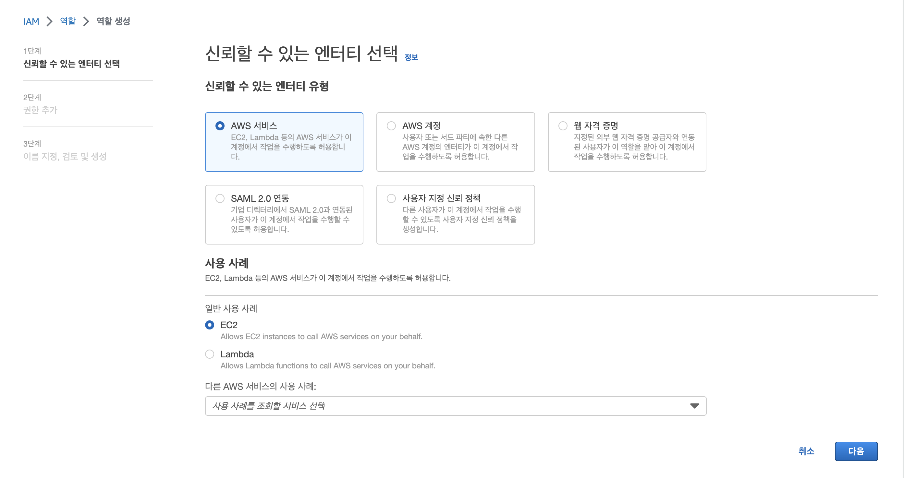
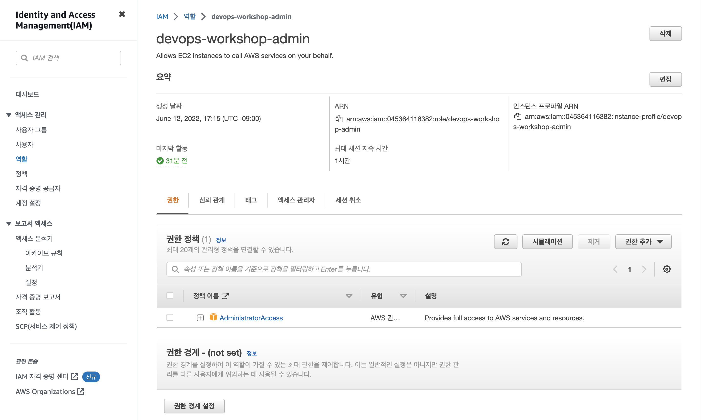
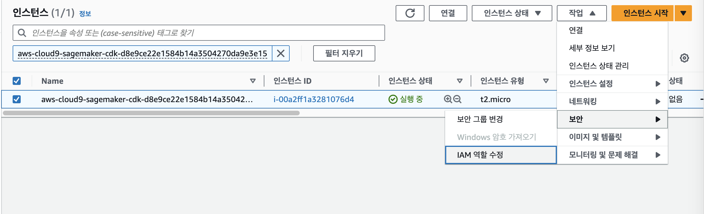
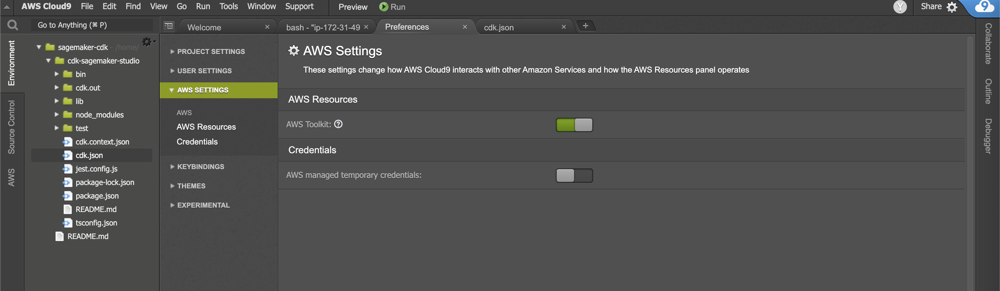
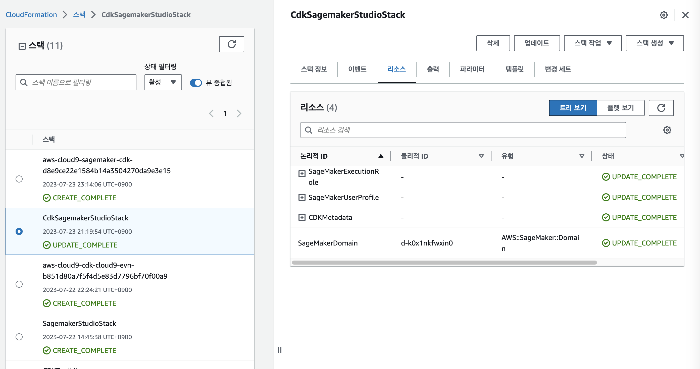
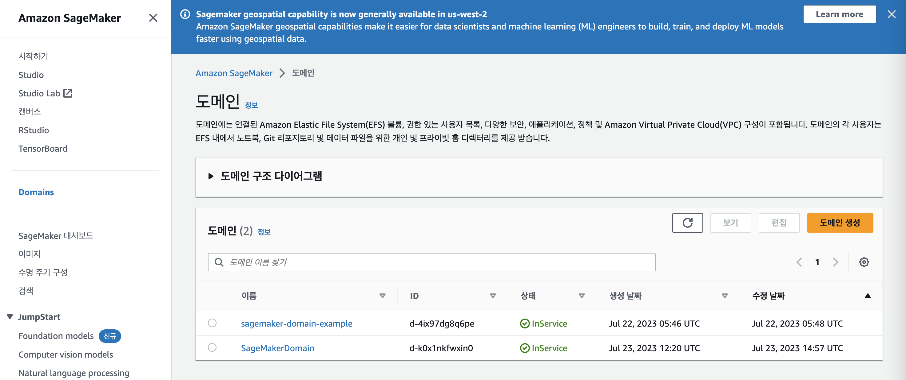
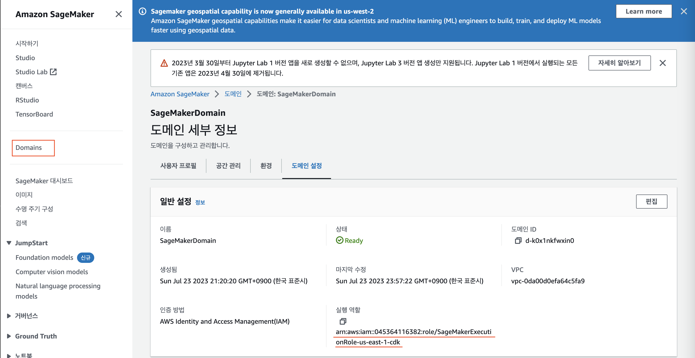
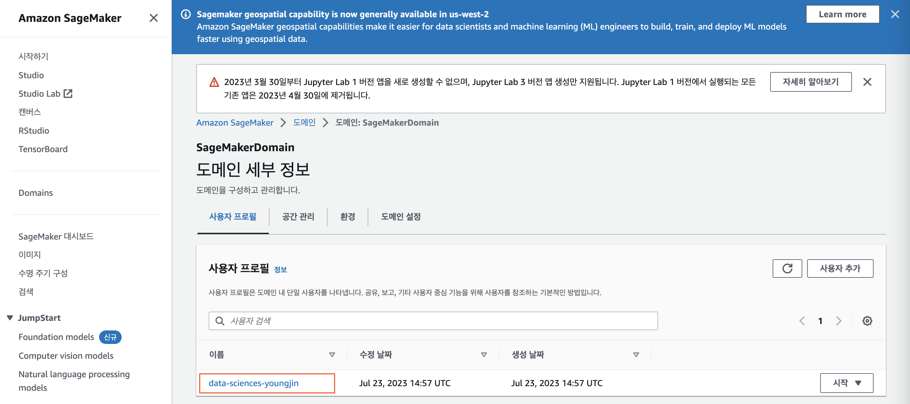
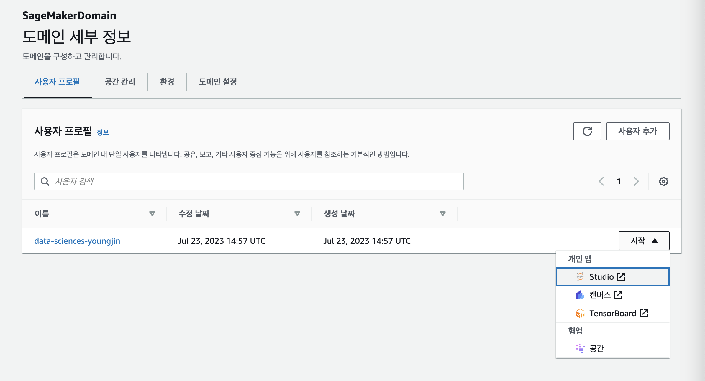
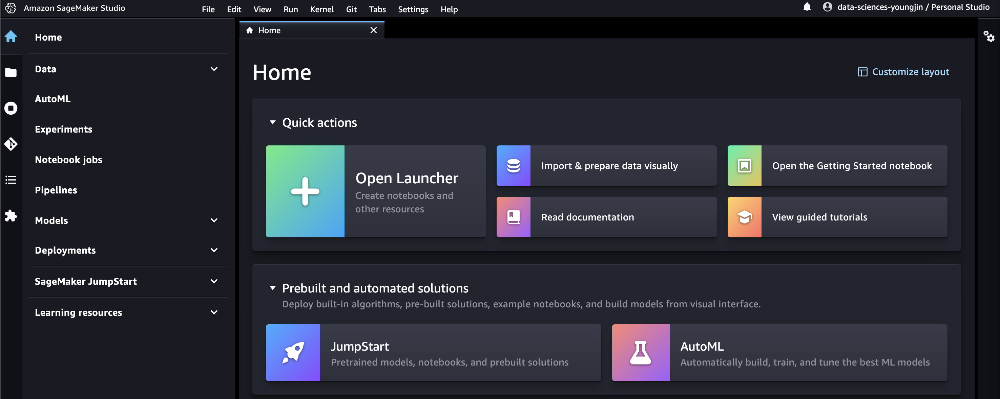

# Prerequisite

* Sign in to the [AWS Management Console](https://console.aws.amazon.com/)
* Go to [Cloud9](https://console.aws.amazon.com/cloud9/) environment. and Click Open IDE

NodeJS Installed
* `nvm install node` or `brew install node`
* `node -v` and `npm -v`

AWS CDK command line installed
* `npm install -g aws-cdk` or `npm install -g aws-cdk@2.88.0 --force`
* `cdk --version`<br>
  This cdk test on 2.88.0 (build 5d497f9)

## CDK version2 install
* `npm install aws-cdk-lib`
* `npm install constructs`
  
이 문서에 표시된 모든 하위 라이브러리는 이미 aws-cdk-lib에 있습니다.
```
// for v1
import * as sagemaker from '@aws-cdk/aws-sagemaker';
// for v2
import * as sagemaker from 'aws-cdk-lib/aws-sagemaker';
```

cdk-sagemaker-studio-stack.ts의 첫번재로 sagamaker execution rolename 을 생성합니다. 
```
    // create a SageMakerExecutionRole-${region}-cdk for the SageMaker Studio
    let sagemakerExecutionRole = new Role(this, 'SageMakerExecutionRole', {
      assumedBy: new ServicePrincipal('sagemaker.amazonaws.com'),
      roleName: `SageMakerExecutionRole-${region}-cdk`,
      description: 'SageMaker execution role'
    });
```

Managed Policy 권한을 role에 부여합니다.
```
    // add AmazonSageMakerFullAccess and AmazonS3FullAccess to the role
    sagemakerExecutionRole.addManagedPolicy(
      ManagedPolicy.fromAwsManagedPolicyName('AmazonSageMakerFullAccess')
    );

    sagemakerExecutionRole.addManagedPolicy(
      ManagedPolicy.fromAwsManagedPolicyName('AmazonS3FullAccess')
    );
    
    // create a SageMakerUserSettings for the SageMaker Studio
    const userSettings = {
      executionRole: sagemakerExecutionRole.roleArn,
    }
```

Default VPC의 subnet에 Sagemaker Domain을 CfnDomain으로 생성합니다.
```
    // set a default VPC for the SageMaker Studio
    const defaultVpc = ec2.Vpc.fromLookup(this, 'DefaultVpc', {
      isDefault: true
    });

    const vpcSubnets = defaultVpc.selectSubnets({
      subnetType: ec2.SubnetType.PUBLIC
    });

    // create a SageMakerDomain for the SageMaker Studio
    const domain = new sagemaker.CfnDomain(this, 'SageMakerDomain', {
      authMode: 'IAM',
      domainName: 'SageMakerDomain',
      defaultUserSettings: userSettings,
      subnetIds: vpcSubnets.subnetIds,
      vpcId: defaultVpc.vpcId,
    });
```

profile name을 team과 name으로 조합하여 Sagemaker 사용자를 생성합니다.
```
    // create a SageMakerUserProfile for the SageMaker Studio
    const profile = {'team': 'data-sciences', 'name': 'youngjin'}
    new sagemaker.CfnUserProfile(this, 'SageMakerUserProfile', {
      domainId: domain.attrDomainId,
      userProfileName: `${profile.team}-${profile.name}`,
      userSettings: userSettings,
    });
```

# Step 1 - Cloud9 instance role change to role
1. Cloud9을 위한 IAM 역할 생성
   IAM > role 생성(역할 만들기) > EC2 사용사례 선택
       
2. Role 만들고 Cloud9 권한 설정
   AdministratorAccess 권한설정 후 역할이름을 `devops-workshop-admin` 만듭니다.
   
   Cloud9의 Manage EC2 instance > 작업(보안) > IAM 역할수정 > `devops-workshop-admin` 연결
   
3. 기존 자격증명 파일 제거  
   Cloud9의 AWS SETTING > Credentials(AWS managed temporary credentials: disable)
   
4. aws sts get-caller-identity 명령어로 변경확인
  `aws sts get-caller-identity` 
```
{
    "Arn": "arn:aws:sts::04XXX4116382:assumed-role/devops-workshop-admin/i-00a2ff1a3281076d4"
}
```
# Step 2 - Clone the code Github repo
`git clone https://github.com/comeddy/cdk-sagemaker-studio.git`<br>
`cd cdk-sagemaker-studio`

`bin/cdk-sagemaker-studio.ts` - 메인 CDK 앱과 스택이 정의된 엔트리 포인트 파일입니다.<br>
`lib/cdk-sagemaker-studio-stack.ts` -  스튜디오 도메인, 스튜디오 사용자 프로필 및 스튜디오 사용자 앱을 정의하는 세이지메이커 스튜디오 스택 파일입니다.
# Step 3 - Welcome to your CDK TypeScript project

This is a blank project for CDK development with TypeScript.

The `cdk.json` file tells the CDK Toolkit how to execute your app.

## Useful commands
* `cdk docs (doc)`  Opens the CDK API Reference in your browser
* `cdk doctor`      Checks your CDK project for potential problems

## Deploy your SageMaker Studio stack commands
* `cdk synth`       emits the synthesized CloudFormation template
* `cdk deploy`      deploy this stack to your default AWS account/region
* `cdk diff`        compare deployed stack with current state
* `cdk destroy`     Destroys one or more specified stacks

# Step 4 - Review your SageMaker Studio stack
AWS 관리 콘솔에서 Cloud Formation을 열면 다음과 같은 SageMaker Studio 스택과 리소스가 생성된 것을 볼 수 있습니다.


# Step 5 - Sagemaker Domain 과 Execution Role 생성
Sagemaker에 SageMakerDomain 이름으로 도메인 생성 확인합니다.
<br>
Sagemaker Execution Role은 Cloud9이 실행된 region 혹은 aws config region 이름으로 역할생성/소멸됩니다.<br>
<br>
<br>

## Mac 같은 노트북에서 멀티리전에 배포시 aws config default를 변경
로컬 시스템에서는 aws config default region 변경하시면 Sagemaker Execution Role도 별도 반영합니다.<br>
* `vi ~/.aws/config`

```
[default]
region = ap-northeast-2
output = json
```
region이 ap-northeast-2 일 경우<br>
```SageMakerExecutionRole-ap-northeast-2-cdk```

## Sagemaker studio 사용자 프로필 로그인
